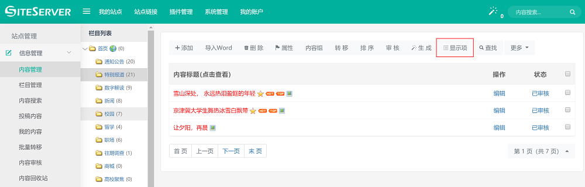
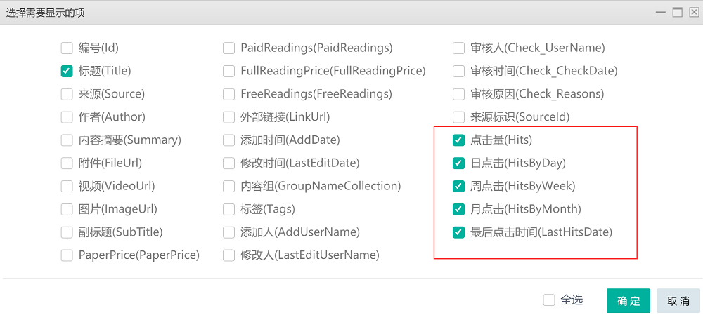
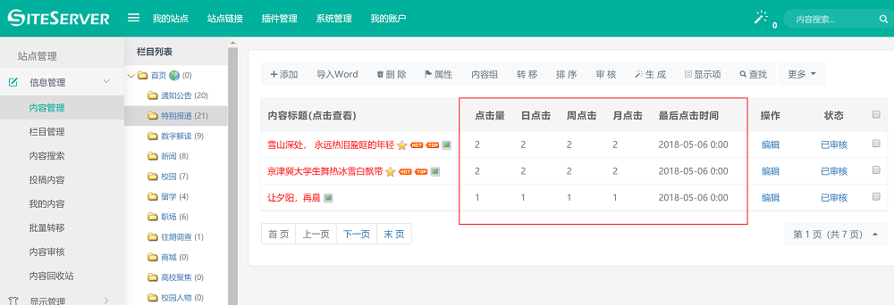

# 后台显示内容点击量

后台默认不显示内容点击量，需要在内容列表中设置显示项。

## 设置显示项

进入左侧菜单"站点管理" -> "内容管理"，在显示的栏目树中选择对应栏目：

在内容列表中点击**"显示项"**命令，勾选点击量相关的选项：

对应的显示项说明如下：

- 点击量(Hits)：内容总点击量
- 日点击(HitsByDay)：内容今天的点击量
- 周点击(HitsByWeek)：内容本周的总点击量
- 月点击(HitsByMonth)：内容本月的总点击量
- 最后点击时间(LastHitsDate)：内容最后一次被访问的时间

## 查看内容点击量

进入后台内容列表，可以看到点击量相关属性已经显示在列表中了：

点击前台页面后刷新内容列表将可以看到数字变化。