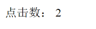

# 前台显示内容点击量

内容点击量存储在内容表中，具体字段解释如下：

- 点击量(Hits)：内容总点击量
- 日点击(HitsByDay)：内容今天的点击量
- 周点击(HitsByWeek)：内容本周的总点击量
- 月点击(HitsByMonth)：内容本月的总点击量
- 最后点击时间(LastHitsDate)：内容最后一次被访问的时间

## 添加标签

在内容模板中添加如下标签：

```html
点击量：<stl:content type="Hits" isDynamic="true"></stl:content>
```

重新生成内容页，刷新浏览器查看效果。

## 查看效果

进入前台内容页，可以看到点击量显示在页面中：



刷新页面将可以看到数字变化。